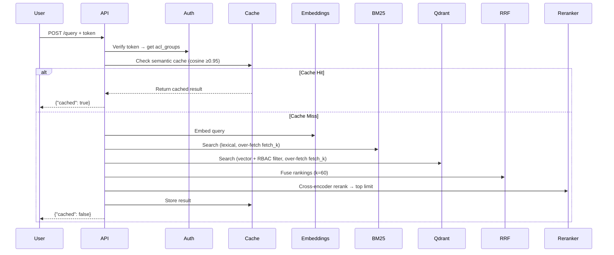
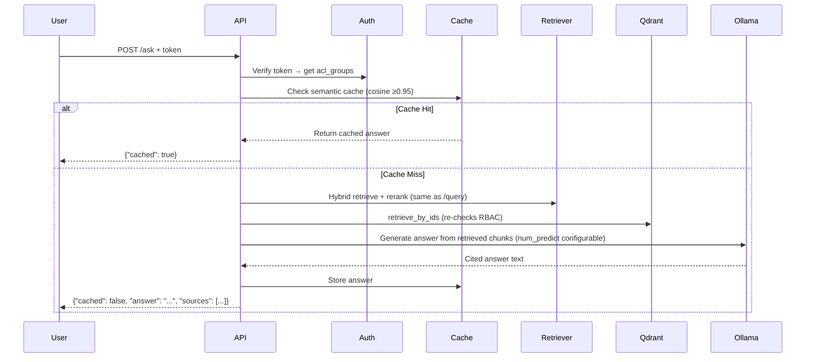

# Enterprise RAG Platform

A production-grade Retrieval-Augmented Generation (RAG) platform with hybrid search, cross-encoder reranking, local LLM answer generation, role-based access control (RBAC), semantic caching, and evaluation framework. Includes a lightweight web UI (chat + document upload) served directly by the API — no separate frontend build or server.

## Starting the Platform

Three things need to be running, in this order. Each runs in its own
terminal (or backgrounded) and keeps running — nothing here is a one-shot
command.

### 1. Start the backing services (Docker)

```bash
make up
```

Starts PostgreSQL, Qdrant, MinIO, Redis, and Jaeger via `docker-compose`.
Wait for `docker-compose ps` to show all 5 containers running before
continuing (`python3 scripts/smoke_infra.py` will confirm they're actually
reachable, not just started).

**First time only** — create the database schema, demo users, and ingest
the 3 seed PDFs:

```bash
python3 scripts/seed.py
```

### 2. Start the API server

```bash
python3 -m src.api.main
```

A plain Uvicorn process on port 8000, run in the foreground (`Ctrl+C` to
stop) or backgrounded with `nohup python3 -m src.api.main &`. It loads the
embedding model on startup, which takes a few seconds — wait for
`Uvicorn running on http://0.0.0.0:8000` before hitting it. This is **not**
a docker-compose service — `make up` does not start it.

Requires step 1's services to already be running. For `/ask` (and the
chat UI) to generate answers, Ollama also needs to be running locally with
the model pulled:

```bash
ollama pull llama3.1:8b
```

`/query`, `/ingest`, and the rest of the API work without Ollama; only
`/ask`-based generation needs it.

### 3. Open the web UI

With the API server running, just open:

```
http://localhost:8000
```

The UI is served directly by the API — there is no separate frontend
process or port to start. Pick a demo user from the dropdown (or paste a
custom token), then use the **Chat** tab to ask questions or the
**Upload Documents** tab to ingest a new PDF.

### Stopping

```bash
# Stop the API server: Ctrl+C (or `kill` the backgrounded process)
# Stop the docker services:
make down
```

## Quick Start

The above gets the platform running. This section additionally covers the
full dev workflow — tests, evaluation, and the raw API without the UI.

**IMPORTANT: Follow steps in order!**

```bash
# 0. Prerequisite for /ask: Ollama with a local model pulled
ollama pull llama3.1:8b

# 1. Start infrastructure
make up

# 2. Verify all services are healthy
python3 scripts/smoke_infra.py

# 3. SEED DATABASE (REQUIRED - do this before anything else!)
make seed

# 4. Run tests
make test

# 5. RE-SEED (make test wipes users/documents as part of its fixtures)
python3 scripts/seed.py
python3 scripts/generate_golden.py

# 6. Start API server (in one terminal)
python3 -m src.api.main

# 7. Open the web UI in a browser
open http://localhost:8000

# 8. Or test endpoints directly (in another terminal)
python3 scripts/test_golden.py    # Validate retrieval quality
python3 scripts/eval.py            # Run evaluation metrics
python3 scripts/test_ask_api.py    # Test direct Q&A endpoint (LLM-generated answers)
```

**If you get "user_a not found" error:** Run `make seed` - it's required! Note
that `make test` truncates the `users`/`documents` tables as part of its own
test fixtures (`tests/test_ingestion.py`) — re-run `python3 scripts/seed.py`
after every `make test` before hitting the live API.

## Architecture

```
┌─────────────────────────────────────────────────────────────────┐
│ FastAPI Server (port 8000)                                      │
│ ┌─────────────────────────────────────────────────────────────┐ │
│ │ POST /query (token auth) → Hybrid Retrieval → Chunk IDs     │ │
│ │ POST /ask   (token auth) → Hybrid Retrieval → LLM Answer    │ │
│ │ POST /ingest                                                │ │
│ │ GET /admin/audit                                            │ │
│ └─────────────────────────────────────────────────────────────┘ │
└──────────────────┬──────────────────────────────────────────────┘
                   │
        ┌──────────┼──────────┬──────────────┬─────────────┐
        │          │          │              │             │
        v          v          v              v             v
    ┌────────┐ ┌──────────┐ ┌──────┐ ┌────────────┐ ┌────────────┐
    │ Redis  │ │ Qdrant   │ │MinIO │ │ PostgreSQL │ │ Ollama     │
    │ Cache  │ │ Vectors  │ │ Docs │ │ Metadata   │ │ (llama3.1) │
    └────────┘ └──────────┘ └──────┘ └────────────┘ └────────────┘
                   │                                       ^
        ┌──────────┴──────────────────┐                    │
        │                             │                     │
        v                             v                     │
  ┌──────────────┐          ┌──────────────────┐            │
  │ BM25 Ranking │          │ Vector Search    │            │
  │ (Sparse)     │          │ (Dense, RBAC     │            │
  │              │          │  pre-filtered)   │            │
  └──────────────┘          └──────────────────┘            │
        │                             │                     │
        └──────────────┬──────────────┘                     │
                       v                                    │
              ┌─────────────────┐                           │
              │ RRF Fusion      │                           │
              │ (k=60)          │                           │
              └─────────────────┘                           │
                       │                                    │
                       v                                    │
              ┌─────────────────┐                           │
              │ Cross-Encoder   │                           │
              │ Reranking       │                           │
              └─────────────────┘                           │
                       │                                    │
             ┌─────────┴─────────┐                          │
             │                   │                          │
             v                   v                           │
    /query: return IDs   /ask: text + LLM ───────────────────┘
```

## Web UI

`GET /` serves a self-contained static page (`src/api/static/`) directly
from the FastAPI app — no Node.js, no build step, no separate server or
port. Two panels:

- **Chat** — asks `/ask`; renders the generated answer plus source badges
  (`{source} #{chunk_id}`); an "Advanced" section exposes `limit` and
  `max_tokens` per-query
- **Upload Documents** — drag-and-drop (or click-to-choose) a PDF, pick an
  `acl_group`, and it's ingested via `/ingest/upload`

The user/token selector is a dropdown of the two seeded demo users
(`user_a`/`user_b`, tokens baked into the page — this is a demo auth model,
not how you'd ship real credentials to a browser) plus a custom-token field
for anything else. All requests are same-origin (UI and API share a port),
so there's no CORS configuration to worry about.

## Technology Stack & Purposes

### Infrastructure (Docker Compose)

**PostgreSQL 16** (`rag_postgres`)
- **Purpose:** Relational database for document metadata, user profiles, ACL groups
- **What it does:** Stores user accounts, document references, audit logs
- **Why:** Persistent metadata storage, ACID guarantees, relational queries

**Qdrant** (`rag_qdrant`)
- **Purpose:** Vector database for semantic search
- **What it does:** Stores dense embeddings (384-dim), enables fast similarity search
- **Why:** Efficient vector indexing (HNSW), built-in filtering (payload indexes)
- **RBAC Integration:** Payload filter on `acl_groups` pre-filters results at query time

**MinIO** (`rag_minio`)
- **Purpose:** Object storage for PDF documents
- **What it does:** Stores raw/processed PDF files
- **Why:** S3-compatible, local development friendly, reliable storage

**Redis** (`rag_redis`)
- **Purpose:** Semantic cache for query results
- **What it does:** Caches embeddings + results, keyed by query embedding similarity (≥0.95 cosine)
- **Why:** Sub-second cache hits, reduces recomputation, invalidated on ingest

**Jaeger** (`rag_jaeger`)
- **Purpose:** Distributed tracing (OpenTelemetry export)
- **What it does:** Records spans for API calls, retrieval steps, cache hits/misses
- **Why:** Production observability, latency debugging

**Ollama** (local, not in docker-compose — run separately)
- **Purpose:** Local LLM inference for the `/ask` endpoint's answer generation
- **What it does:** Runs `llama3.1:8b` on-machine, no API key or per-call cost
- **Why:** `/ask` needs an actual generation step, not just retrieved chunk
  text (see [ADR 0007](docs/adr/0007-local-llm-generation.md))
- **Setup:** `ollama pull llama3.1:8b` before starting the API

### Python Stack

**FastAPI**
- **Purpose:** REST API framework for /query, /ingest, /admin/audit endpoints
- **What it does:** HTTP server, request validation, async request handling
- **Why:** Fast, async-native, built-in OpenAPI docs

**SQLAlchemy + Alembic**
- **Purpose:** ORM for PostgreSQL + schema migrations
- **What it does:** Python objects ↔ database rows, version control for schema
- **Why:** Type-safe queries, migration tracking

**Sentence Transformers**
- **Purpose:** Generate dense embeddings (384-dim) for chunks/queries, and rerank retrieved candidates
- **What it does:** `SentenceTransformer` (all-MiniLM-L6-v2) converts text → vector; `CrossEncoder` (ms-marco-MiniLM-L-6-v2) scores a (query, passage) pair directly for reranking
- **Why:** Embeddings are pre-trained, fast, and good quality; the cross-encoder catches relevant chunks that pure vector/BM25 ranking missed (see [ADR 0006](docs/adr/0006-cross-encoder-reranking.md))

**rank-bm25**
- **Purpose:** Sparse (keyword-based) ranking
- **What it does:** BM25 algorithm for term frequency scoring
- **Why:** Complements dense search, captures exact phrase matches

**pdfplumber**
- **Purpose:** Extract text from PDFs
- **What it does:** Page-by-page text extraction
- **Why:** Structure-aware (preserves tables), reliable

### Retrieval Pipeline

**Hybrid Search = BM25 + Vector + RRF + Cross-Encoder Reranking**

1. **BM25 (Sparse Lexical Search)**
   - Ranks documents by term frequency (TF-IDF variant)
   - Excels at exact phrase matching: `"attention is all you need"` → top results
   - Fast, no embeddings needed

2. **Vector Search (Dense Semantic Search)**
   - Query embedding → find nearest 384-dim vectors in Qdrant
   - **RBAC Pre-Filter:** Qdrant payload filter `acl_groups` applied at query level
   - Excels at semantic similarity: `"transformer blocks"` ≈ `"encoder layers"`

3. **RRF (Reciprocal Rank Fusion, k=60)**
   - Combines rankings: `fused_score = 1/(k+rank1) + 1/(k+rank2)`
   - Balances sparse + dense results
   - Robust to outlier rankings
   - BM25 and vector search each over-fetch `max(limit*4, 20)` candidates
     (not just `limit`) so the reranker has a real candidate pool to work with

4. **Cross-Encoder Reranking** (`cross-encoder/ms-marco-MiniLM-L-6-v2`)
   - Scores each `(query, chunk_text)` pair directly, rather than via
     separately-computed embeddings
   - Reorders the RRF-fused candidates and truncates to the final `limit`
   - Local, no per-query cost — see [ADR 0006](docs/adr/0006-cross-encoder-reranking.md)

**Result:** Top-K chunks (RBAC-pre-filtered, reranked) that answer the query

### Answer Generation (/ask only)

`/query` returns chunk IDs; `/ask` goes one step further and generates an
actual answer:

1. Run the retrieval pipeline above to get the top-K relevant chunks
2. Fetch full chunk text via `QdrantService.retrieve_by_ids()` (re-checks
   RBAC independently — see [ADR 0003](docs/adr/0003-rbac-pre-filtering.md))
3. Build a prompt instructing a local LLM (`llama3.1:8b` via Ollama) to
   answer *only* from the provided chunks, citing `[Source N]`, and to say
   so if the context doesn't contain the answer
4. Return the generated answer + cited sources

See [ADR 0007](docs/adr/0007-local-llm-generation.md) for why this is a
local model rather than a hosted LLM API.

### RBAC (Role-Based Access Control)

**Enforcement Point:** Inside Qdrant query, NOT post-retrieval

```python
# MANDATORY acl_groups parameter
filter_cond = Filter(
    must=[FieldCondition(key="acl_groups", match=MatchAny(any=user_acl_groups))]
)
results = client.query_points(..., query_filter=filter_cond, ...)
```

**Why pre-filtering?** 
- Security: User B's vectors never returned to User A (even by accident)
- Efficiency: Filter applied before scoring (fewer comparisons)
- Correctness: Not a post-hoc validation (can't be misconfigured)

**Isolation:** Each ingested chunk has payload `{"acl_groups": ["public"]}` or `["private"]`

**Second gate for /ask:** `QdrantService.retrieve_by_ids()` re-checks each
retrieved point's `acl_groups` against the caller's before its text reaches
the LLM prompt or API response — independent of the pre-filter above, in
case that invariant is ever violated upstream.

### Semantic Cache (Redis)

**Key:** Query embedding (384-dim vector)
**Value:** Query result (top chunks)
**Hit Condition:** Cosine similarity ≥ 0.95

```
User asks: "Transformer architecture"
  → embed → [0.12, -0.05, 0.18, ...]
  → Redis: cosine_sim([...], cached_query) = 0.96 ✓ CACHE HIT
  → return cached result (x-cache: hit header)
```

**Invalidation:** On ingest, clear user's cache (per-user key prefix)

### Evaluation Framework

**Golden Dataset:** 25 Q/A pairs with reference chunk IDs
**Metrics:**
- **Precision@5:** % of top-5 results marked relevant
- **Recall@5:** % of relevant docs found in top-5

> **Caveat:** the golden dataset's reference chunk IDs are generated by
> `scripts/generate_golden.py` using plain vector search top-3 — not the
> actual hybrid+rerank pipeline. P@5/R@5 measures agreement with that
> simpler baseline, not ground-truth relevance. Useful as a regression
> signal (did something change retrieval behavior unexpectedly), not as an
> absolute quality score.

## File Structure

```
Enterprise-RAG-Platform/
├── docker-compose.yml          # 5 services: PostgreSQL, Qdrant, MinIO, Redis, Jaeger
├── Makefile                    # Targets: up, down, test, lint, seed, eval
├── pyproject.toml              # Python 3.12, uv package manager
│
├── src/
│   ├── api/
│   │   ├── main.py            # FastAPI app: /query, /ask, /ingest(/upload), /admin/audit, /
│   │   ├── auth.py            # Bearer token auth
│   │   ├── cache.py           # Redis semantic cache (≥0.95 cosine)
│   │   ├── uploads.py         # Multipart PDF upload validation + safe disk save
│   │   └── static/            # Web UI: index.html, styles.css, app.js (served at /)
│   │
│   ├── retrieval/
│   │   ├── bm25.py            # rank_bm25 sparse search
│   │   ├── vector_search.py    # Qdrant search with RBAC pre-filter
│   │   ├── rrf.py             # RRF fusion (k=60)
│   │   ├── reranker.py        # Cross-encoder reranking (ms-marco-MiniLM-L-6-v2)
│   │   └── retriever.py       # Orchestration: BM25 + vector + RRF + rerank
│   │
│   ├── ingestion/
│   │   ├── pdf_processor.py   # pdfplumber text extraction (x_tolerance=1), chunking
│   │   ├── embeddings.py      # sentence-transformers (all-MiniLM-L6-v2)
│   │   └── ingester.py        # Orchestration: extract → embed → store
│   │
│   ├── services/
│   │   └── generation.py      # AnswerGenerator: local LLM synthesis via Ollama
│   │
│   └── storage/
│       ├── db.py              # SQLAlchemy engine, session management
│       ├── models.py          # User, Document, AclGroup, schema
│       ├── minio_client.py    # MinIO object storage
│       └── qdrant_client.py   # Qdrant vector store (query_points, upsert, retrieve_by_ids)
│
├── tests/
│   ├── test_ingestion.py      # Postgres ↔ Qdrant, RBAC isolation
│   ├── test_retrieval.py      # BM25, vector search, RRF, RBAC, retrieve_by_ids
│   ├── test_reranker.py       # Cross-encoder reranking (mocked model)
│   ├── test_generation.py     # Local LLM generation (mocked Ollama calls)
│   └── test_uploads.py        # Upload validation: type, size, filename sanitization
│
├── scripts/
│   ├── smoke_infra.py         # Health checks for all 5 services
│   ├── seed.py                # Download 3 arXiv PDFs, ingest, create users
│   ├── generate_golden.py     # Generate eval dataset with real chunk IDs
│   ├── test_golden.py         # Validate retrieval quality (100% match)
│   ├── test_ask_api.py        # Manual test of /ask (LLM-generated answers)
│   └── eval.py                # Precision@5, recall@5
│
├── evals/
│   ├── golden.jsonl           # 25 Q/A triples with chunk IDs
│   └── baseline.json          # Baseline metrics (created on first eval)
│
└── docs/
    ├── api-examples.md        # curl examples: /query, /ask, caching, max_tokens
    └── adr/                   # Architecture Decision Records
```

## Running the Platform

### 1. Start Services

```bash
make up
```

**What happens:**
- Pulls 5 Docker images
- Starts containers (postgres, qdrant, minio, redis, jaeger)
- Waits for healthchecks to pass
- Exposes ports: PostgreSQL 5432, Qdrant 6333, MinIO 9000/9001, Redis 6379, Jaeger 16686

### 2. Verify Health

```bash
python scripts/smoke_infra.py
```

**Output:**
```
✓ PostgreSQL: healthy
✓ Qdrant: healthy
✓ MinIO: healthy
✓ Redis: healthy
✓ Jaeger: healthy
```

### 3. Seed Database

```bash
make seed
```

**What it does:**
- Creates Postgres schema (users, documents, acl_groups)
- Creates 2 demo users (user_a: public only, user_b: public + private)
- Downloads 3 arXiv PDFs: Attention Is All You Need (1706.03762),
  LLaMA 2 (2307.09288), Segment Anything (2304.02643)
- Chunks PDFs (1130 total chunks)
- Generates embeddings (384-dim each)
- Stores in Qdrant with acl_groups payloads
- Stores metadata in Postgres

### 4. Run Tests

```bash
make test
```

**Tests (15 total):**
- Ingestion: Chunks stored in Postgres + Qdrant
- Retrieval: BM25 exact match, vector search, RRF fusion, RBAC, `retrieve_by_ids`
- Reranking: cross-encoder scoring/truncation (mocked model)
- Generation: local LLM prompt building, response parsing, error handling (mocked Ollama)
- RBAC: User A never sees User B's chunks (across 20 queries)

**Note:** `tests/test_ingestion.py` truncates the `users`/`documents`/`acl_groups`
tables as part of its setup — re-run `python3 scripts/seed.py` after `make test`
before using the live API again.

### 5. Start API Server

```bash
# Requires Ollama running with the model pulled, for /ask:
ollama pull llama3.1:8b

python -m src.api.main
```

**Endpoints:**
- `POST /query` - Hybrid search + rerank, RBAC + cache → chunk IDs
- `POST /ask` - Same retrieval, then a local LLM generates a cited answer
- `POST /ingest` - Add new documents
- `GET /admin/audit` - Audit log
- `GET /health` - Liveness check

**Authentication:** Bearer token in Authorization header

### 6. Query the API

```bash
TOKEN="e7e0ac4358145a17fe33582f906e237bab13f388fcbc564de60b757fb6371f6a"

# First query (not cached)
curl -X POST http://localhost:8000/query \
  -H "Authorization: Bearer $TOKEN" \
  -H "Content-Type: application/json" \
  -d '{"query": "Transformer architecture", "limit": 5}'

# Same query (cached)
curl -X POST http://localhost:8000/query \
  -H "Authorization: Bearer $TOKEN" \
  -H "Content-Type: application/json" \
  -d '{"query": "Transformer architecture", "limit": 5}'

# Direct Q&A with an LLM-generated, cited answer
curl -X POST http://localhost:8000/ask \
  -H "Authorization: Bearer $TOKEN" \
  -H "Content-Type: application/json" \
  -d '{"query": "How does attention work?", "limit": 8, "max_tokens": 256}'
```

See [docs/api-examples.md](docs/api-examples.md) for full request/response
examples including RBAC isolation and `max_tokens` customization.

### 7. Evaluate Retrieval Quality

```bash
python scripts/test_golden.py        # Validation (should be 100%)
python scripts/eval.py                # Precision@5, recall@5
```

## Key Design Decisions

| Decision | Rationale |
|----------|-----------|
| **Hybrid Search (BM25 + Vector + RRF)** | Pure vector misses exact phrases; pure BM25 misses semantics. RRF balances both. |
| **Cross-Encoder Reranking** | RRF-only retrieval missed relevant chunks in practice; a local cross-encoder catches them at no per-query cost. See [ADR 0006](docs/adr/0006-cross-encoder-reranking.md). |
| **Local LLM Generation (/ask)** | `/ask` needs real answer synthesis, not raw chunk dumps; a local model avoids API cost/keys. See [ADR 0007](docs/adr/0007-local-llm-generation.md). |
| **RBAC Pre-Filtering** | Security: filter at Qdrant query level, not post-retrieval (can't be misconfigured). Re-checked again in `/ask`'s `retrieve_by_ids`. |
| **Semantic Cache (Redis)** | Cosine ≥0.95: catches paraphrased queries without re-ranking. Invalidated per-user on ingest. Known gap: cache key ignores `limit`/`max_tokens` — see [ADR 0004](docs/adr/0004-semantic-cache-invalidation.md). |
| **384-dim Embeddings** | all-MiniLM-L6-v2: fast inference (batch), good quality, 384 dims manageable in memory. |
| **Qdrant Over Pinecone** | Local development, built-in filtering, no vendor lock-in. |
| **PostgreSQL for Metadata** | ACID guarantees, relational queries (joins on users↔acl_groups), audit logs. |

## Troubleshooting

| Issue | Fix |
|-------|-----|
| `Connection refused: localhost:5432` | `make up` must finish. Check `docker-compose ps`. |
| `Qdrant: [SSL: WRONG_VERSION_NUMBER]` | Use `http://` not `https://` for local Qdrant. |
| `RBAC isolation failing` | Check chunk payloads in Qdrant: `{"acl_groups": ["public"]}` required. |
| `Cache not hitting` | Cosine similarity must be ≥0.95. Slight rewording may not hit. |
| `Evaluation metrics 0%` | Check golden.jsonl chunk IDs exist in Qdrant. Run `test_golden.py`. |
| `/ask` returns 503 `LLM generation failed` | Ollama isn't running, or the model isn't pulled. Run `ollama pull llama3.1:8b` and confirm `curl localhost:11434/api/tags` responds. |
| `/ask` answer looks stale after changing `limit`/`max_tokens` | Cache key doesn't include those fields (known gap, see ADR 0004). Run `redis-cli FLUSHALL`. |
| `user_a not found` after `make test` | `tests/test_ingestion.py` truncates users/documents as test setup. Re-run `python3 scripts/seed.py`. |

## Evaluation & CI

- `make eval` computes precision@5, recall@5 against the golden dataset
- Baseline saved after first run; CI fails if a change regresses precision by more than 5%
- GitHub Actions: lint + test + eval on every PR

## Engineering Notes

A few non-obvious things worth knowing if you're reading the code:

- `/ask` runs the same hybrid retrieval + reranking pipeline as `/query`,
  then hands the top chunks to a local LLM (Ollama) to synthesize a cited
  answer rather than returning raw chunk text
- Cross-encoder reranking sits after RRF fusion — RRF alone was missing
  relevant chunks in practice (see [ADR 0006](docs/adr/0006-cross-encoder-reranking.md))
- BM25 and vector search originally returned incompatible ID spaces
  (corpus positions vs. Qdrant point IDs), silently corrupting RRF fusion —
  fixed by mapping BM25 hits through a per-ACL-group ID list before fusion
- `pdfplumber`'s default `x_tolerance` merged adjacent words together on
  this corpus's tightly-kerned PDFs (e.g. "Atinferencetime" instead of
  "At inference time") — fixed with `extract_text(x_tolerance=1)`
- Generation length is configurable via `OLLAMA_NUM_PREDICT` (server
  default) or per-request `max_tokens`, rather than relying on the model's
  own default output cutoff

## Running Individual Components

```bash
# Lint code
make lint
make lint-fix

# Clean up
make clean

# View logs
make logs

# Ingest new document (after API running)
curl -X POST http://localhost:8000/ingest \
  -H "Authorization: Bearer $TOKEN" \
  -H "Content-Type: application/json" \
  -d '{"source": "arxiv", "file_path": "/path/to/pdf", "acl_group": "public"}'
```

## Summary

This RAG platform demonstrates:
- **Hybrid search:** BM25 + semantic + RRF fusion + cross-encoder reranking
- **Answer generation:** `/ask` synthesizes a cited answer via a local LLM (Ollama), not just raw chunk text
- **RBAC:** Pre-filtering, not post-hoc — enforced independently again on the `/ask` chunk-fetch path
- **Caching:** Semantic similarity (not exact match)
- **Production patterns:** Layered architecture, OTel spans, comprehensive tests
- **Evaluation:** Golden dataset, precision@5, recall@5 (see caveat above on what this metric actually measures)

## Query Sequence Diagram



## Ask Sequence Diagram



## Eval Results

| Metric | Value |
|--------|-------|
| Precision@5 | 38.4% |
| Recall@5 | 64% |
| Golden Q/A | 25 |
| Ingested Chunks | 1130 (99 + 629 + 402) |
| RBAC Isolation | 100% |
| Regression Detection | ✓ |

See the caveat under **Evaluation Framework** above — this measures
agreement with a plain-vector-search baseline, not true relevance. The
number moved slightly (was 40%/66.7% pre-reranking) because reranking now
disagrees more with that baseline, not because retrieval quality regressed;
see [ADR 0006](docs/adr/0006-cross-encoder-reranking.md) for the direct
evidence that reranking helped (`/ask` output before/after).

## Notable Bugs Found & Fixed

A sample of real issues hit during development, kept here because the fixes
are non-obvious from reading the current code alone:

| Issue | Resolution |
|-------|-----------|
| Jaeger image tag `v1.56.0` doesn't exist | Use `latest` tag |
| SQLAlchemy FK missing in many-to-many relationship | Add explicit FK constraint |
| `psycopg2` not found; `postgres://` URL scheme deprecated | Use `postgresql+psycopg://` (psycopg3) |
| `HTTPAuthCredentials` doesn't exist in the installed FastAPI version | Custom Bearer token parsing via `Header()` |
| SQLAlchemy object detached after session close; can't lazy-load relations | `joinedload()` before closing the session |
| Corpus cache dict keyed by an unhashable list (acl_groups) | Convert to a sorted tuple for the cache key |
| Golden dataset chunk IDs didn't match what was actually in Qdrant | Regenerate golden set from live retrieval, not hand-picked |
| Eval script was bypassing the actual retriever and testing raw Qdrant search | Route eval through `HybridRetriever` |
| `pdfplumber` merged adjacent words with no space on tightly-kerned PDFs | `extract_text(x_tolerance=1)` |
| Seeded arXiv IDs pointed to the wrong papers entirely | Corrected IDs in `scripts/seed.py` |
| `/ask` never generated an answer — just returned raw chunk text | Added `AnswerGenerator` (local Ollama LLM) |
| `HTTPException` raised inside `/ask`'s try block got remapped to 500 by the outer generic handler | Added `except HTTPException: raise` before the generic catch |
| BM25 returned corpus positions, vector search returned Qdrant IDs — RRF silently fused incompatible ID spaces | `HybridRetriever` maps BM25 positions through a per-ACL-group ID list before fusion |
| Single shared `BM25Search` instance overwritten when different users' ACL scopes triggered a corpus rebuild | Dedicated `BM25Search` instance per ACL-group cache key |
| Ollama call had no `options.num_predict`, subject to the model's own default output-length cutoff | `OLLAMA_NUM_PREDICT` env var (default `-1`, uncapped) + per-request `max_tokens` override |
| Semantic cache key ignores `limit`/`max_tokens` — stale answer served after changing either | Documented as a known limitation, see [ADR 0004](docs/adr/0004-semantic-cache-invalidation.md) |

## Verifying the Setup

Once running, this sequence should complete cleanly:

```bash
ollama pull llama3.1:8b                   # prerequisite for /ask
make up && python scripts/smoke_infra.py  # all 5 services healthy
make seed                                 # 1130 chunks ingested
make test                                 # test suite passes
python scripts/seed.py                    # re-seed (make test wipes users/documents)
python scripts/generate_golden.py         # golden Q/A set regenerated
python scripts/eval.py                    # precision@5 / recall@5 printed
python scripts/test_ask_api.py            # sample /ask questions answered
```
